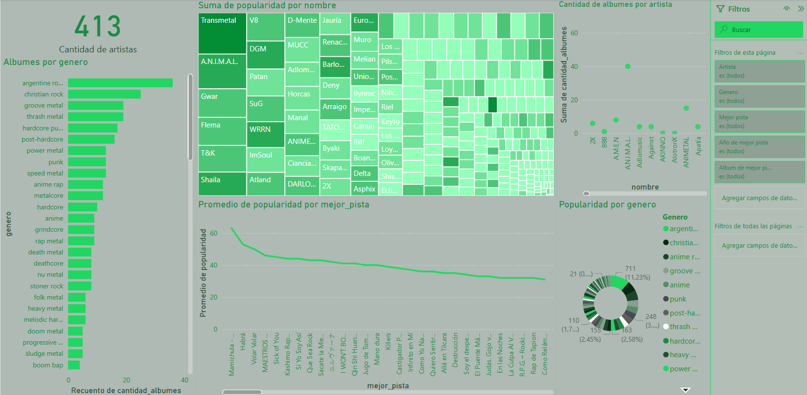
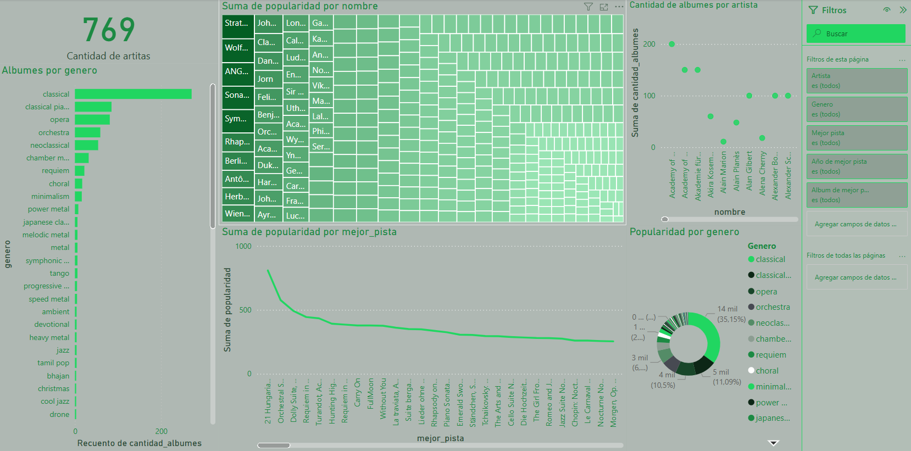
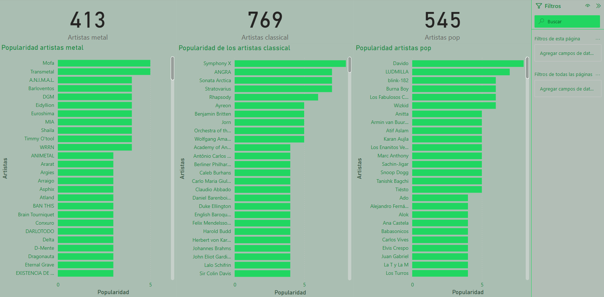

# Spotify_Comparacion
# Análisis Comparativo de Géneros Musicales: Metal, Clásico y Pop

Este proyecto está dedicado a comparar tres géneros musicales: **Metal**, **Clásico** y **Pop**.

La motivación principal fue analizar dos géneros que suelen ser menos populares en mi entorno (Metal y Clásico) frente a uno mucho más difundido en Argentina: el Pop. La idea era observar diferencias y similitudes en características musicales, subgéneros, y evolución a lo largo del tiempo.

## 🎧 Recolección de Datos

Para obtener los datos utilicé la **API de Spotify**. Esta API permite obtener información de hasta 50 artistas por solicitud, por lo que realicé múltiples extracciones aleatorias, evitando que el análisis se centre únicamente en los artistas más escuchados.

Dado que no todas las consultas devolvieron la misma cantidad de datos por género, la cantidad final de artistas varía:

- **Metal:** 413 artistas  
- **Clásico:** 769 artistas  
- **Pop:** 545 artistas

> ⚠️ Esto implica que la comparación no es perfectamente equilibrada en términos de volumen de datos por género, aunque sigue siendo válida para un análisis general.

## 🌍 Criterios de Selección

Uno de los filtros principales fue que los artistas fueran **escuchados en Argentina**, independientemente de su país de origen. Si bien la selección fue aleatoria, por cada artista obtuve:

- Sus canciones más populares
- Subgéneros asociados
- Álbumes publicados y sus años de lanzamiento

## ⚙️ Proceso de Trabajo

Durante la recolección de datos, me aseguré de que **no se repitieran artistas** dentro de un mismo género. Aunque algunos artistas aparecen asociados a múltiples subgéneros, utilicé la combinación de `offset` y `limit` para evitar que fueran extraídos nuevamente en futuras solicitudes a la API de Spotify.

### 🧩 ¿Cómo funciona `offset`?

- `limit` indica cuántos artistas se quieren traer en cada extracción (por ejemplo, 50).
- `offset` indica desde qué posición empezar a traer los resultados.

📌 Ejemplo:  
- En la primera extracción (`offset=0`), se obtienen los primeros 50 artistas.  
- En la segunda (`offset=50`), los siguientes 50.  
- Y así sucesivamente.

Esto permite **paginar los resultados** y obtener artistas distintos en cada batch, evitando repeticiones (salvo que Spotify modifique el orden de los resultados entre consultas).

Una vez finalizadas todas las extracciones, obtuve múltiples archivos `.csv`. Para continuar con el análisis, desarrollé un segundo script que se encargó de **unificar todos los archivos en un solo dataset consolidado**.

Cada archivo contiene las siguientes columnas:

- `nombre`: nombre del artista  
- `popularidad`: puntaje de popularidad del artista (según Spotify)  
- `genero`: subgénero asociado al artista  
- `cantidad de álbumes`: total de álbumes publicados por el artista  
- `mejor pista`: canción más popular del artista  
- `álbum de la mejor pista`: álbum en el que se encuentra esa canción  
- `año de la mejor pista`: año de lanzamiento del álbum correspondiente

Luego, cargué estos tres datasets en una base de datos de **SQL Server**, donde creé una base llamada `Spotify`. Esto me permitió **consultar los datos con mayor comodidad**, además de preparar los datos de forma más estructurada para **visualizarlos en Power BI**.

## 📊 Visualización en Power BI

Para el análisis visual trabajé con **Power BI**, donde diseñé distintos dashboards para explorar y comparar los datos recolectados.

- Comencé modelando la **hoja de Metal**, definiendo visualizaciones clave como distribución de popularidad, cantidad de álbumes por artista y evolución temporal.
- Una vez validado ese diseño, repliqué la lógica de visualización para los otros dos géneros: **Clásico** y **Pop**, manteniendo la coherencia visual y estructural entre las páginas.

Además, desarrollé una **hoja comparativa** donde analizo la **popularidad promedio y distribución** de artistas entre los tres géneros, teniendo en cuenta la diferencia en la cantidad de artistas disponibles por cada uno (Metal: 413, Clásico: 769, Pop: 545). Esto garantiza una comparación lo más justa y representativa posible.

Estas visualizaciones permiten identificar tendencias, diferencias y similitudes entre los géneros desde una perspectiva cuantitativa basada en datos reales extraídos de Spotify.

## 📷 Visualizaciones

### 🎸 Hoja de análisis: Metal

### 🎻 Hoja de análisis: Clásico

### 🎤 Hoja de análisis: Pop

### ⚖️ Comparativa entre géneros

